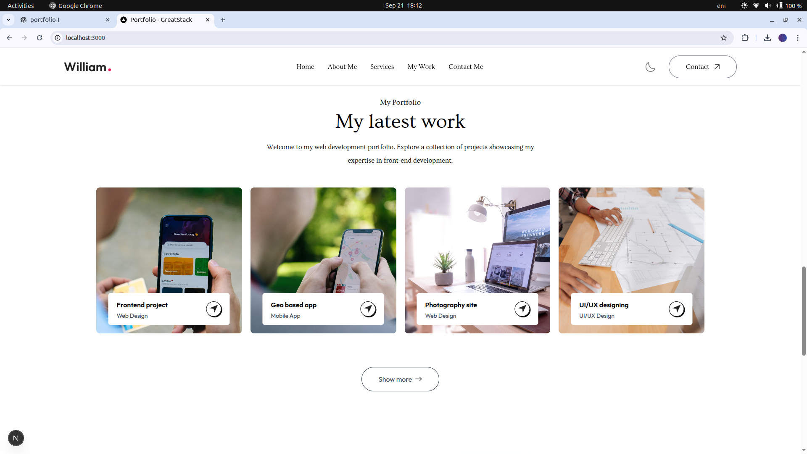
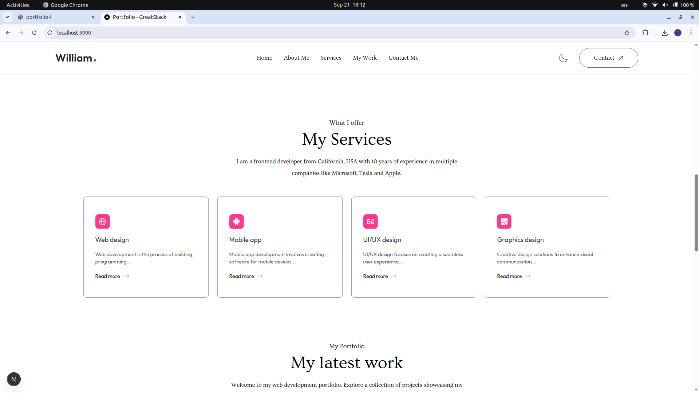
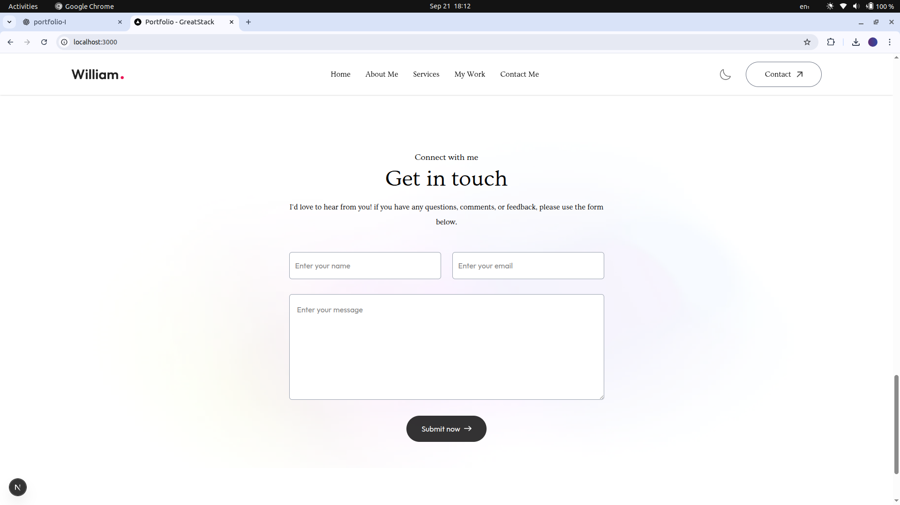

<h1 align="center">
  <span style="vertical-align:middle;">My Next.js Project</span>
  
</h1>

[](https://nextjs.org/)  
[](https://nodejs.org/)  
[](./LICENSE)  
[](https://vercel.com/)  

A modern web application built with [Next.js](https://nextjs.org), bootstrapped using [`create-next-app`](https://github.com/vercel/next.js/tree/canary/packages/create-next-app).  

---

<h1 align="center">
  
  Portfolio Website
</h1>

<p align="center">💼 A modern developer portfolio built with Next.js, Tailwind CSS v4, and custom dark/light theme support.</p>

---

## 📸 Screenshots

<div align="center" style="display: flex; flex-wrap: wrap; gap: 10px; justify-content: center;">
  
  
  
</div>

---

## 🔗 Live Demo

[🚀 Visit Portfolio Website](https://alwaysyash.vercel.app)

---

## 🚀 Features

- 🌓 Light & Dark theme toggle with persistence using `localStorage`.
- 🧩 Modular and reusable React components (`Navbar`, `Header`, `Services`, `Work`, etc.).
- 📱 Fully responsive design for mobile, tablet, and desktop.
- 🎨 Custom styling powered by **Tailwind CSS v4** with `@theme` tokens.
- ⚡ Smooth scrolling navigation with scroll offsets.
- 📂 Dynamic service cards rendered from structured data.
- 🖼 Optimized images using Next.js `<Image>` component.

---

## 🧰 Tech Stack Used

- **Next.js 14** – React framework for SSR/SSG
- **React 18** – Component-based UI
- **Tailwind CSS v4** – Utility-first styling with `@theme` configuration
- **PostCSS** – CSS transformations
- **JavaScript (ES6+)** – Logic and interactivity
- **Next/Image** – Image optimization
- **LocalStorage + MatchMedia** – Theme persistence & system preference detection

---

## 📂 Project Directory Structure

```
PORTFOLIO/
├── app/
│ ├── layout.js
│ └── page.js
├── assets/
├── components/
│ ├── About.jsx
│ ├── Contact.jsx
│ ├── Footer.jsx
│ ├── Header.jsx
│ ├── Navbar.jsx
│ ├── Services.jsx
│ └── Work.jsx
├── public/
│ └── favicon.ico
├── styles/
│ └── globals.css
├── next.config.mjs
├── postcss.config.mjs
├── eslint.config.mjs
├── package.json
└── README.md
```

---

## 📦 Getting Started  

### 1️⃣ Clone the repo  
```bash
git clone https://github.com/zoom169speedster/portfolio-I.git
cd your-repo
```
### 2️⃣ Install dependencies
```
npm install
# or
yarn install
# or
pnpm install
# or
bun install
```
### 3️⃣ Run the development server
```
npm run dev
```
Now open http://localhost:3000
 in your browser 🎉

---
## 📚 Learn More

- 📖 **Next.js Documentation** – [official guides and API reference](https://nextjs.org/docs)
- 🎓 **Learn Next.js** – [interactive tutorial for beginners](https://nextjs.org/learn)
- 💻 **Next.js GitHub** – [contribute & explore the source](https://github.com/vercel/next.js)

---

## 📄 License
This project is open-source and available under the [MIT License](LICENSE).

---

## 👤 Author

<table width="100%">
  <tr>
    <td align="left">
      <h3>Yash Kushwaha</h3>
    </td>
    <td align="right">
      <a href="mailto:yash274602@gmail.com"></a>
      <a href="https://www.instagram.com/alwaysyash616"></a>
      <a href="https://www.facebook.com/alwaysyash616"></a>
      <a href="https://www.linkedin.com/in/alwaysyash"></a>
      <a href="https://t.me/alwaysYash616"></a>
      <a href="https://github.com/zoom169speedster"></a>
    </td>
  </tr>
</table>

- GitHub: [alwaysyash616](https://github.com/zoom169speedster)  
- Frontend Mentor: [@alwaysyash616](https://www.frontendmentor.io/profile/alwaysyash616)  
- Instagram: [@alwaysyash616](https://www.instagram.com/alwaysyash616)  
- Facebook: [@alwaysyash616](https://www.facebook.com/alwaysyash616)  
- LinkedIn: [@alwaysyash616](https://www.linkedin.com/in/alwaysyash)  
- Telegram: [@alwaysYash616](https://t.me/alwaysYash616)  
- Email: yash274602@gmail.com  

---

> 💡 _“Little bit Pro🎓essional by @lwaysyash”_

